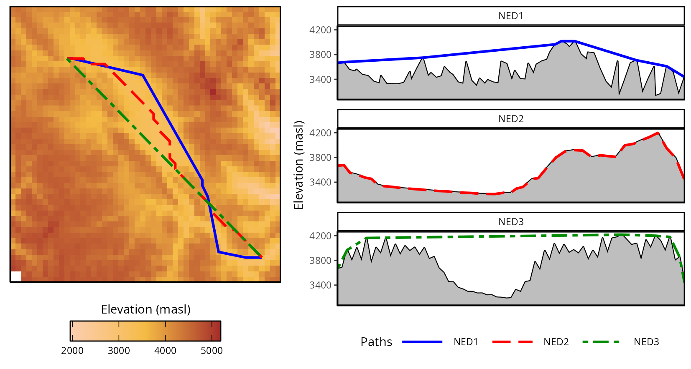
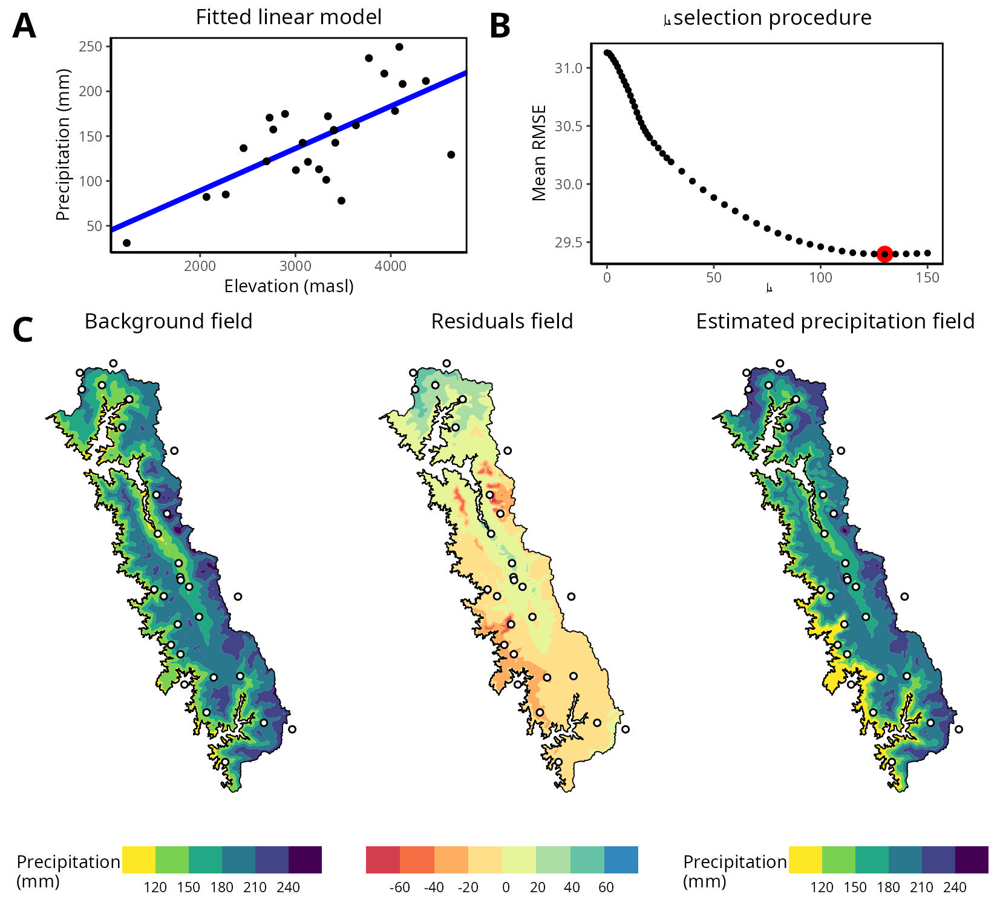

# non-euclidean-distances

This repository contains the code of the paper **"Can non-Euclidean distances improve spatial interpolation of precipitation in mountainous regions?"**

<!-- 

  

-->

  

  

**Note**: Large files were omitted to avoid making the repository too heavy and may need to be recreated using the R scripts.

